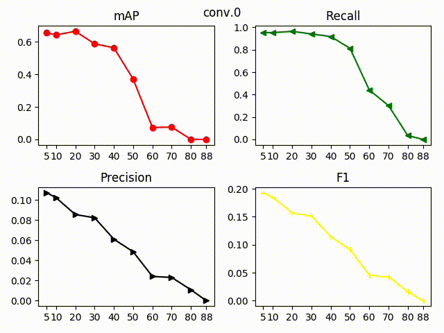
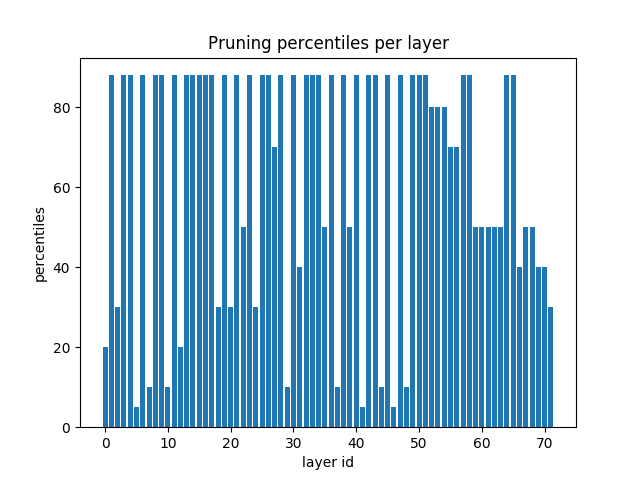

## Goal
1. Sensitivity Analysis layer-wise
2. Estimating computational weight per layer (FLOPS)
3. Estimating thresholds per layer based on the above
4. Running the pruning process

### Main Idea:
The model architecture is based on [PyTorch-YOLOv3](https://github.com/eriklindernoren/PyTorch-YOLOv3).
Trained the model with the pretrained yolov3.weights on the [hand dataset](link here) for 10 epochs.
Run the sensitivity analysis per layer with the following pruning percentiles: [5, 10, 20, 30, 40, 50, 60, 70, 80, 88]
(above 88 yields a bug in the architecture)
Final pruning with the best pick in the plots for mAP for each of the above percentiles
Fine tuned the pruned model for 10 epochs. All final average precisions were generated from 103 images.


##### run the sensitivity analysis layer-wise
```
python3 run_sensitivity_analysis.py
```


##### run and generate the pruned model
```
pyhton3 final_pruning.py
```


#### check accuracy and compare models
```
python3 test.py
```


#### Plotting the analysis of layerwise weight pruning
[](data/all_plots_analysis.gif)


Thresholds per layer



weights | description |
---|---
[last_hand_checkpoint.pth](https://drive.google.com/open?id=1fp2ZbEEyPPaO3aKY5685cvc5l7ULuwT2) | trained on the hand dataset
[pruned.pth](https://drive.google.com/open?id=1ptKftkm8AlrGJpwzTQsOEyw6vlD0OBXW) | just pruned
[yolov3_ckpt_9_03010931.pth](https://drive.google.com/open?id=1yfsrMuvJG17kopePVvz2pNs2yS3x4b0F) | finetuned the pruned model


| | Parameters | FLOPs | mAP | 
--- | --- | --- | ---
Origin | 61.52 M  |  32.76 GMac | [0.715]()
Pruned | 39.37 M | 25.4 GMac |  0.0864
Finetuned |39.37 M |25.4 GMac | [0.717]()


### Layerwise parameters count
Layer|Baseline params|Pruned params
---|---|---
conv_0 | 928 | [841]()
conv_1 | 18560 | [16832]()
conv_2 | 2112 | 2112
conv_3 | 18560 | 18560
conv_5 | 73984 | 73984
conv_6 | 8320 | [8190]()
conv_7 | 73984 | [72832]()
conv_9 | 8320 | 8320
conv_10 | 73984 | 73984
conv_12 | 295424 | 295424
conv_13 | 33024 | 33024
conv_14 | 295424 | 295424
conv_16 | 33024 | 33024
conv_17 | 295424 | 295424
conv_19 | 33024 | [6708]()
conv_20 | 295424 | [60416]()
conv_22 | 33024 | [7224]()
conv_23 | 295424 | [65024]()
conv_25 | 33024 | 33024
conv_26 | 295424 | 295424
conv_28 | 33024 | [31992]()
conv_29 | 295424 | [286208]()
conv_31 | 33024 | [20640]()
conv_32 | 295424 | [184832]()
conv_34 | 33024 | 33024
conv_35 | 295424 | 295424
conv_37 | 1180672 | 1180672
conv_38 | 131584 | [78642]()
conv_39 | 1180672 | [706048]()
conv_41 | 131584 | 131584
conv_42 | 1180672 | 1180672
conv_44 | 131584 | [96118]()
conv_45 | 1180672 | [862720]()
conv_47 | 131584 | [13878]()
conv_48 | 1180672 | [125440]()
conv_50 | 131584 | [81212]()
conv_51 | 1180672 | [729088]()
conv_53 | 131584 | [129528]()
conv_54 | 1180672 | [1162240]()
conv_56 | 131584 | [111538]()
conv_57 | 1180672 | [1000960]()
conv_59 | 131584 | 131584
conv_60 | 1180672 | 1180672
conv_62 | 4720640 | 4720640
conv_63 | 525312 | [519156]()
conv_64 | 4720640 | [4665344]()
conv_66 | 525312 | 525312
conv_67 | 4720640 | 4720640
conv_69 | 525312 | [514026]()
conv_70 | 4720640 | [4619264]()
conv_72 | 525312 | [34884]()
conv_73 | 4720640 | [315392]()
conv_75 | 525312 | [210330]()
conv_76 | 4720640 | [757270]()
conv_77 | 525312 | [84460]()
conv_78 | 4720640 | [1135905]()
conv_79 | 525312 | [189419]()
conv_80 | 4720640 | [680190]()
conv_81 | 18450 | [4446]()
conv_84 | 131584 | [79104]()
conv_87 | 197120 | 197120
conv_88 | 1180672 | 1180672
conv_89 | 131584 | 131584
conv_90 | 1180672 | 1180672
conv_91 | 131584 | 131584
conv_92 | 1180672 | [283638]()
conv_93 | 9234 | 2232]()
conv_96 | 33024 | 33024
conv_99 | 49408 | 49408
conv_100 | 295424 | 295424
conv_101 | 33024 | 33024
conv_102 | 295424 | 295424
conv_103 | 33024 | 33024
conv_104 | 295424 | 295424


### FLOPs per baseline model layer

layer id | GMac (MACs)
--- | --- 
conv_0  |  0.166 ( 0.507%)
conv_1  |  0.806 ( 2.460%)
conv_2  |  0.093 ( 0.283%)
conv_3  |  0.806 ( 2.460%)
conv_5  |  0.802 ( 2.447%)
conv_6  |  0.091 ( 0.277%)
conv_7  |  0.802 ( 2.447%)
conv_9  |  0.091 ( 0.277%)
conv_10  |  0.802 ( 2.447%)
conv_12  |  0.8 ( 2.441%)
conv_13  |  0.09 ( 0.274%)
conv_14  |  0.8 ( 2.441%)
conv_16  |  0.09 ( 0.274%)
conv_17  |  0.8 ( 2.441%)
conv_19  |  0.09 ( 0.274%)
conv_20  |  0.8 ( 2.441%)
conv_22  |  0.09 ( 0.274%)
conv_23  |  0.8 ( 2.441%)
conv_25  |  0.09 ( 0.274%)
conv_26  |  0.8 ( 2.441%)
conv_28  |  0.09 ( 0.274%)
conv_29  |  0.8 ( 2.441%)
conv_31  |  0.09 ( 0.274%)
conv_32  |  0.8 ( 2.441%)
conv_34  |  0.09 ( 0.274%)
conv_35  |  0.8 ( 2.441%)
conv_37  |  0.798 ( 2.437%)
conv_38  |  0.089 ( 0.272%)
conv_39  |  0.798 ( 2.437%)
conv_41  |  0.089 ( 0.272%)
conv_42  |  0.798 ( 2.437%)
conv_44  |  0.089 ( 0.272%)
conv_45  |  0.798 ( 2.437%)
conv_47  |  0.089 ( 0.272%)
conv_48  |  0.798 ( 2.437%)
conv_50  |  0.089 ( 0.272%)
conv_51  |  0.798 ( 2.437%)
conv_53  |  0.089 ( 0.272%)
conv_54  |  0.798 ( 2.437%)
conv_56  |  0.089 ( 0.272%)
conv_57  |  0.798 ( 2.437%)
conv_59  |  0.089 ( 0.272%)
conv_60  |  0.798 ( 2.437%)
conv_62  |  0.798 ( 2.436%)
conv_63  |  0.089 ( 0.271%)
conv_64  |  0.798 ( 2.436%)
conv_66  |  0.089 ( 0.271%)
conv_67  |  0.798 ( 2.436%)
conv_69  |  0.089 ( 0.271%)
conv_70  |  0.798 ( 2.436%)
conv_72  |  0.089 ( 0.271%)
conv_73  |  0.798 ( 2.436%)
conv_75  |  0.089 ( 0.271%)
conv_76  |  0.798 ( 2.436%)
conv_77  |  0.089 ( 0.271%)
conv_78  |  0.798 ( 2.436%)
conv_79  |  0.089 ( 0.271%)
conv_80  |  0.798 ( 2.436%)
conv_84  |  0.022 ( 0.068%)
conv_87  |  0.133 ( 0.407%)
conv_88  |  0.798 ( 2.437%)
conv_89  |  0.089 ( 0.272%)
conv_90  |  0.798 ( 2.437%)
conv_91  |  0.089 ( 0.272%)
conv_92  |  0.798 ( 2.437%)
conv_96  |  0.022 ( 0.068%)
conv_99  |  0.134 ( 0.409%)
conv_100  |  0.8 ( 2.441%)
conv_101  |  0.09 ( 0.274%)
conv_102  |  0.8 ( 2.441%)
conv_103  |  0.09 ( 0.274%)
conv_104  |  0.8 ( 2.441%)


